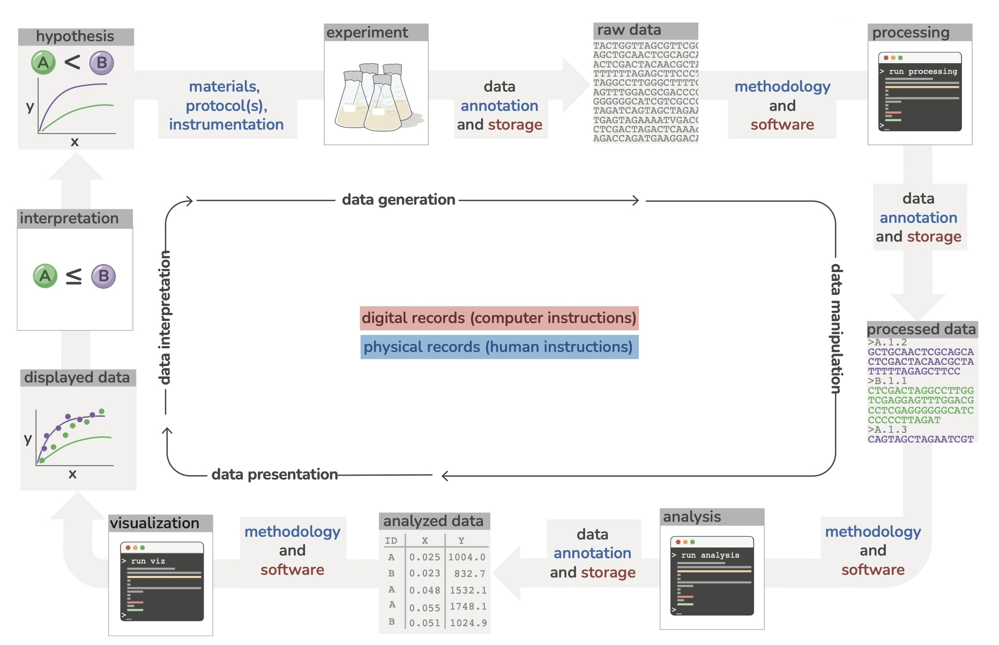
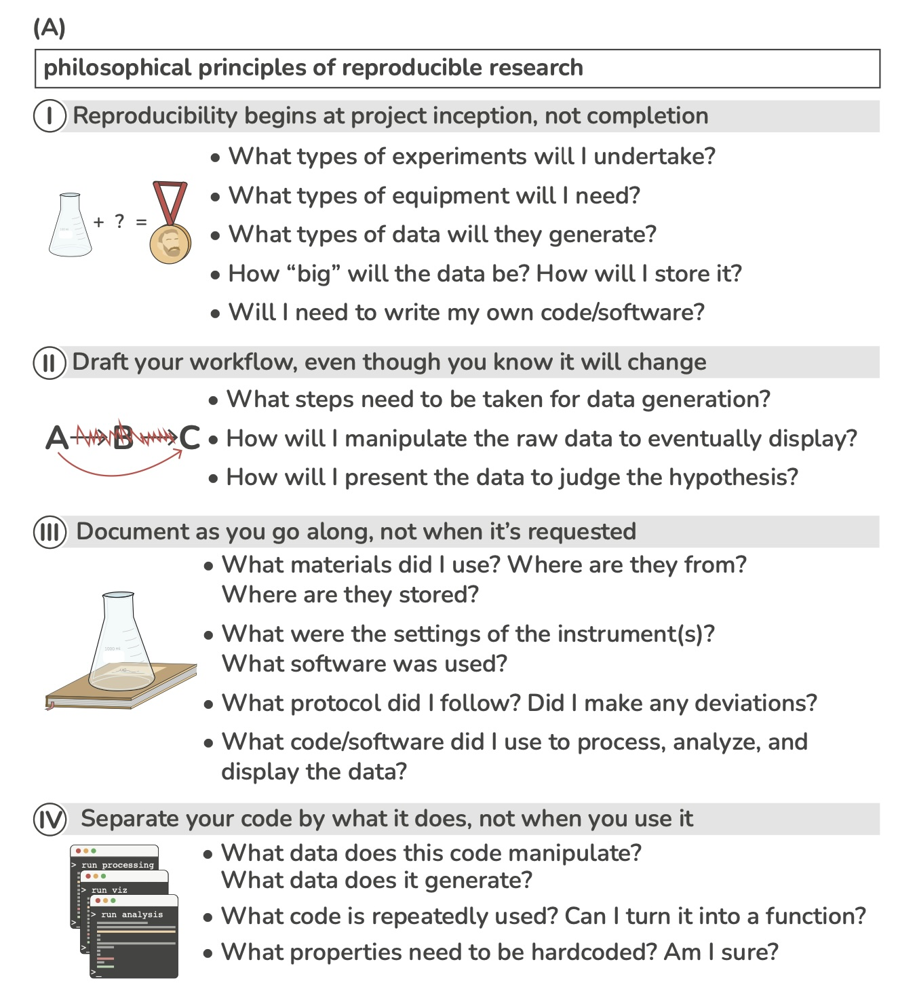
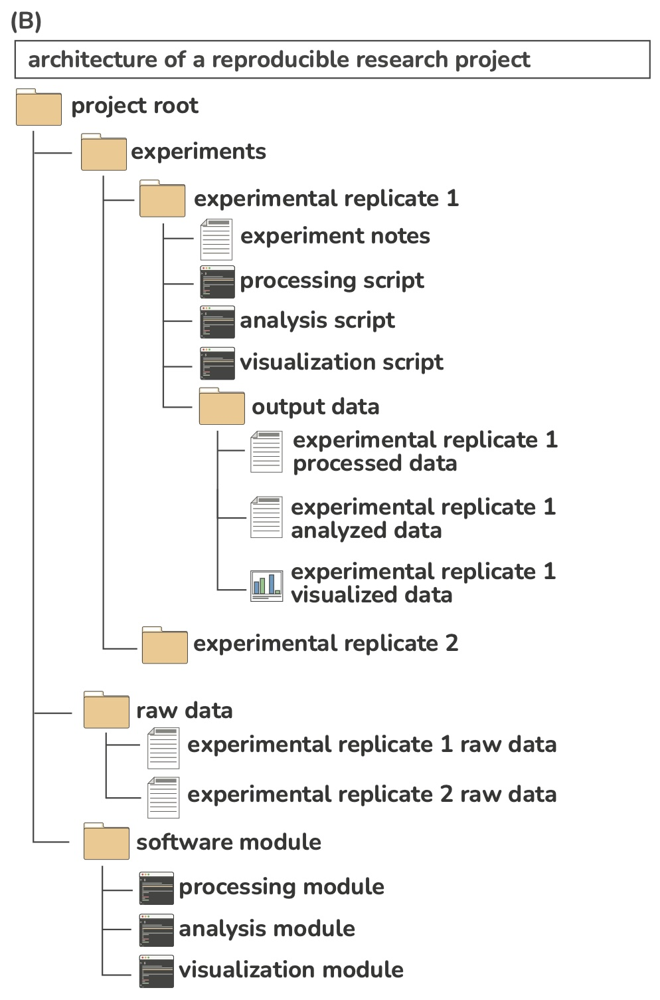
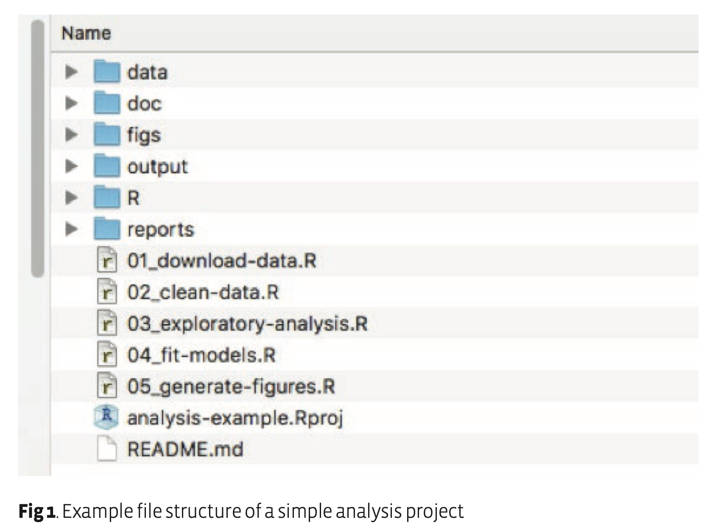

```{r setup, include=FALSE}
knitr::opts_chunk$set(echo = TRUE)
```


<!-- This allows for manual column breaks: -->
<style>
.forceBreak { -webkit-column-break-after: always; break-after: column; }
</style>
<!-- This allows for smaller figure captions: -->
<style>
.figure_caption {
font-size: 40%;
text-align: center;
}
</style>
<!-- This allows for top aligned images: -->
<style>
figure{
    display: inline-block;
    vertical-align: baseline;
    margin:0;
}
</style>
<!-- Footnote -->
<style>
div.footnotes {
  position: absolute;
  bottom: 0;
  margin-bottom: 10px;
  width: 80%;
  font-size: 0.6em;
}
</style>
<style>
.footnote-number {
  font-size: 16px; 
}
</style>
<script src="https://ajax.googleapis.com/ajax/libs/jquery/3.1.1/jquery.min.js"></script>
<script>
$(document).ready(function() {
  $('slide:not(.backdrop):not(.title-slide)').append('<div class=\"footnotes\">');

  $('footnote').each(function(index) {
    var text  = $(this).html();
    var fnNum = (index+1).toString();
    $(this).html('<sup class="footnote-number">  ' + fnNum + '</sup>');

    var footnote   = fnNum + '. ' + text + '<br/>';
    var oldContent = $(this).parents('slide').children('div.footnotes').html();
    var newContent = oldContent + footnote;
    $(this).parents('slide').children('div.footnotes').html(newContent);
  });
});
</script>


## Review: Overview of git and GitHub {.centered}


## Forking and cloning {.centered}


## Branching, merging, and GitHub Flow {.centered}


## Activity: Providing feedback on `README.md` files

* Exchange your GitHub usernames and project repo names with someone else
* You'll each provide feedback on the other's `README.md` file
* Go to their repo on GitHub, look over their `README.md` and write down questions and constructive feedback
* On GitHub, click "Issues", then "New issue"
* Put in your feedback with a title


## Assigned readings jigsaw

* 05 mins: With expert group discuss main points of your reading
* 15 mins: As the expert, share what you learned 
* 15 mins: Class discussion


## Break time!  {.centered}


## Why do file management and workflow matter?

* If you quit today and dropped your project, could a someone pick take over your project and work with your data without talking to you?

* Do you think you could come back to this project in 15 years and reproduce your analysis?


## What makes up a "good analysis workflow"

* Analysis starts from copies of the raw data
   * Deny your permission to write on the raw data files
* Do all data wrangling with scripts - no point-and-click
* Separate your scripts into what they do
   * Loading, cleaning, and wrangling the data
   * Data analysis
   * Create visualizations, tables, statistics
* Intermediary files are kept seperate from the raw data
* WET vs. DRY
   * "Write everything twice"
   * "Don't repeat yourself"


## Draft your workflow {.centered}


<figcaption class="figure_caption">Image from <https://arxiv.org/pdf/2210.02593.pdf></figcaption>


## Draft your workflow 

* This is a living structure 
* How is the data generated?
   * Primary vs. secondary data
   * Type of data
       * `*.xlsx`, `*.csv`, `*.fastq`, `*.gff`, `*.tsv`, images, etc.
   * Track materials, instrument(s), software, etc.
* How big is the data? Where will it be stored?
* How is the raw data manipulated?
* Where is the protocol and any changes made documented?
* How will the data be presented/visualized?


## Answer these questions for your project {.centered}


<figcaption class="figure_caption">Image from <https://arxiv.org/pdf/2210.02593.pdf></figcaption>


## Example of a basic structure for a project directory<footnote>List from <https://www.britishecologicalsociety.org/wp-content/uploads/2019/06/BES-Guide-Reproducible-Code-2019.pdf></footnote> {.smaller}

* The **data** folder contains all input data (and metadat) used in the analysis. 

* The **doc** folder contains the manuscript

* The **figs** directory contains figures generated by the analysis

* The **output** folder contains any type of intermediate or output files (e.g. simulation outputs, models, processed datasets, etc.). You might separate this and also have a **cleaned-data** folder. 

* The R directory contains R scripts with function definitions. 

* The **reports** folder contains RMarkdown files that document the analysis or report on results. 

* The scripts that actually do things are stored in the root directory, but if your project has many scripts, you might want to organise them in a directory of their own. 


## Example project directory {.centered}


<figure>
  
  
</figure>
<figcaption class="figure_caption">Images from <https://arxiv.org/pdf/2210.02593.pdf> and  <https://www.britishecologicalsociety.org/wp-content/uploads/2019/06/BES-Guide-Reproducible-Code-2019.pdf></figcaption>


## Folder structure

* Have a consistent naming scheme

* Arrange folders in hierarchical structure

* Have a README file that describes the project as well as a basic tour of your folder structure

* Include README files in subfolders for files that aren't described or commented easily
    * Include description of file contents, content source(s), relevant papers, etc.
    
* Include an appropriate license

* Seperate in progress and completed work

* Keep track of ideas, notes, discussions and next steps with GitHub Issues


## File naming<footnote>List from <https://www.britishecologicalsociety.org/wp-content/uploads/2019/06/BES-Guide-Reproducible-Code-2019.pdf></footnote> {.smaller}

* **Machine readable** 
    * Avoid spaces, punctuation, accented characters and case sensitivity.
        * More specifically, stick to **"a-zA-Z0- 9_"** characters. 
    * Use periods/full stops for file type only (i.e. `*.csv`). 
    * Use delimiters to separate and make important metadata information (for example parameter values used in an analysis) retrievable further down the line. Use delimiters consistently, i.e. “_” to separate metadata to be extracted as strings later on and “-” instead of spaces or vice versa but do not mix. This makes names easy to match and search programmatically and easy to analyse. 

* **Human readable** 
    * Ensure file names also include informative description of file contents.
    * Adapt the concept of the slug to link outputs with the scripts in which they are generated. 


## File naming<footnote>List from <https://www.britishecologicalsociety.org/wp-content/uploads/2019/06/BES-Guide-Reproducible-Code-2019.pdf></footnote> {.smaller}

* **Easy to order by default **
    * Starting file names with a number helps. 
    * For data, this might be a date allowing chronological ordering. 
    * Make sure to use ISO 8601 format **(YYYY-MM-DD)** to avoid confusion between differing local dating conventions. 
    * For scripts, you could use a number indicating the position of the scripts in the analysis sequence e.g. 01_download-data.R 

* **Make sure you left-pad single digit numbers with a zero or you will end up with this:** 
    * 10_final-figs-for-publication.R 
    * 1_data-cleaning.R 
    * 2_fit-model.R 


## Using Griffin Chure's workflow template

* Navigate to https://github.com/gchure/reproducible_research

* Click on green “Use this template” 

* Select “Create a new repository”

* Clone the new repository to your local machine

* Copy and paste the folders into your project repository

* Play with the structure, folders, naming to fit your own project


## Conclusion

* File management incorporates naming and structure

* Workflow helps you organize your projects and make it easier for others to reproduce your work


