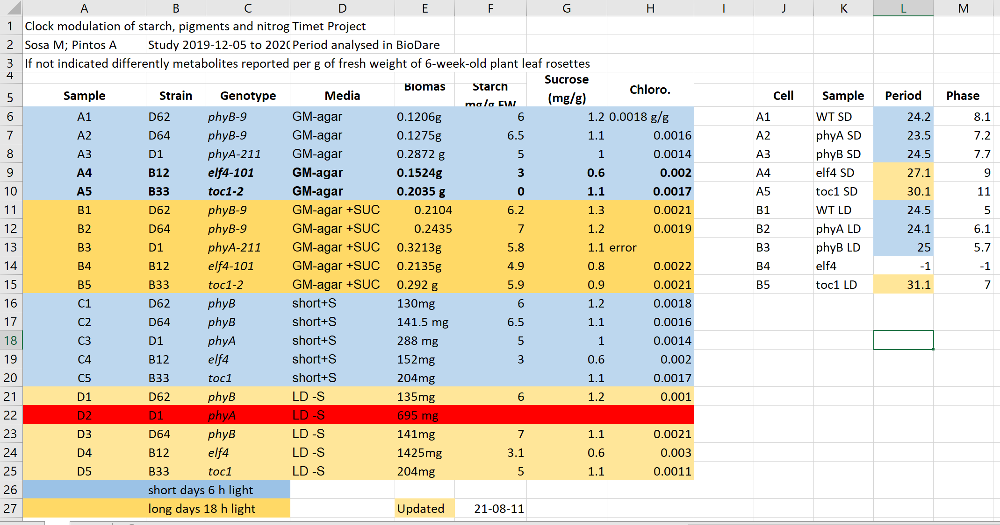

```{r setup, include=FALSE}
knitr::opts_chunk$set(echo = TRUE)
```
```{r source-html, results="asis", echo = FALSE}
# Sourcing file that includes extra html for our class lectures:
cat(readLines("class-preamble.html"), sep = "\n")
```


<!-- Centering specific to this lesson -->
<style>
    .center {
    display: block; 
    margin-left: auto; 
    margin-right: auto; 
    width: 50%; 
    }
</style>


## What is metadata? 

* It is data about your data

* Describes what your data is

* Important for making your data FAIR


## What is metadata? {.centered}


<figcaption class="figure_caption">Image created by SangyaPundir</figcaption>


## Metadata example

### Here's an example of good metadata


<https://carpentries-incubator.github.io/fair-bio-practice/05-intro-to-metadata/index.html#image-metadata>


## Types of metadata

* Administrative metadata
    * assigned to data before it's creation or collection
    * E.g. funder, project collaborators, principle investigator, etc.

* Descriptive or citation metadata
    * data that helps people find your data or resource
    * E.g. keywords, persistent identifier, abstract, authors, etc. 

* Structural metadata
    * How the data was collected/created and how it's structured
    * E.g. Sampling procedure, sample size, variables, units, collection method, etc.


## Identify different metadata types {.centered}


<figcaption class="figure_caption">Image from <https://carpentries-incubator.github.io/fair-bio-practice/05-intro-to-metadata/index.html#image-metadata></figcaption>


## Activity: Identify what metadata you need


### **What kinds of data do (will) you have for your project?**


## Activity: Identify what metadata you need

* Dryad - https://datadryad.org/stash/requirements; https://datadryad.org/stash/best_practices

* Zenodo - https://about.zenodo.org/principles/

* GenBank - https://www.ncbi.nlm.nih.gov/genbank/submit_types/


## Activity: Identify what metadata you need

* What types of metadata do you need?


## Common spreadsheet errors 

* Using multiple tables


## Common spreadsheet errors {.centered}


<figcaption class="figure_caption">Image from <https://stackoverflow.com/questions/23289882/how-to-add-multiple-tables-conversion-from-excel-xls-file-to-xml-c-sharp></figcaption>


## Common spreadsheet errors 

* Using multiple tabs
    * Sometimes these can be missed
    * Difficult to use in code
    


## Common spreadsheet errors {.centered} 


<figcaption class="figure_caption">Image from <https://blog.datawrapper.de/prepare-and-clean-up-data-for-data-visualization/></figcaption>


## Common spreadsheet errors

### Not filling in zeros
    * Difference between a zero and a blank cell

### Using problematic null values


## Common spreadsheet errors {.centered}


<figcaption class="figure_caption">Image from White et al. 2013, *PeerJ Preprints*</figcaption>


## Common spreadsheet errors

### Using formatting to convey information organizing data

* Highlighting cells


## Common spreadsheet errors {.centered}


<figcaption class="figure_caption">Image from <https://carpentries-incubator.github.io/fair-bio-practice/07-data-in-excel/index.html></figcaption>


## Common spreadsheet errors

### Using formatting to convey information organizing data
* Merging cells


## Common spreadsheet errors {.centered}


## Common spreadsheet errors

* Placing comments or units in cells
    * E.g. 0.123g
* Having more than one piece of information in a cell
    * "ID=g24074.t1;Parent=g24074;Alias=g24074.t1;gene=Dupd1;gene_id=Dupd1.g1;description=Similar to Dual specificity protein phosphatase [Sphaeramia orbicularis];Dbxref=InterPro:IPR000387,InterPro:IPR016130,InterPro:IPR020405,InterPro:IPR020422,InterPro:IPR029021,PANTHER:PTHR45682,PANTHER:PTHR45682:SF2,PRINTS:PR01908,PRINTS:PR01909,PFAM:PF00782,ProSitePatterns:PS00383,ProSiteProfiles:PS50054,ProSiteProfiles:PS50056,SMART:SM00195,SUPERFAMILY:SSF52799;Ontology_term=GO:0004725,GO:0016311,GO:0016791;"
* Inconsistent values
    * E.g. Using E. Coli, Escherichia coli, and Ecoli
* Using special characters, spaces, or numbers in column names


## Tidy data

### What makes data tidy?
    1. Every column is a variable
    2. Every row is an observation
    3. Ever cell is a single value
    


## Real life example

Wrangling plate reader data


## Practice making tidy data

* In your group discuss what is wrong with the format of your data
* Create a repository for your metadata project
* Clone the repository to your local git
* Delegate jobs to group members:
    * write readme describing the data
    * reshape the data into a tidy form and change to csv
    * read the data into R making sure it is in the right form
* Each role will push changes to a new branch of the main branch
* As a group pull the changes merging the branches to the main branch
    


## Conclusion

* What kind of metadata do you need for your project?
* How will this metadata be organized in your directory?
* Create metadata for your project data for next class
